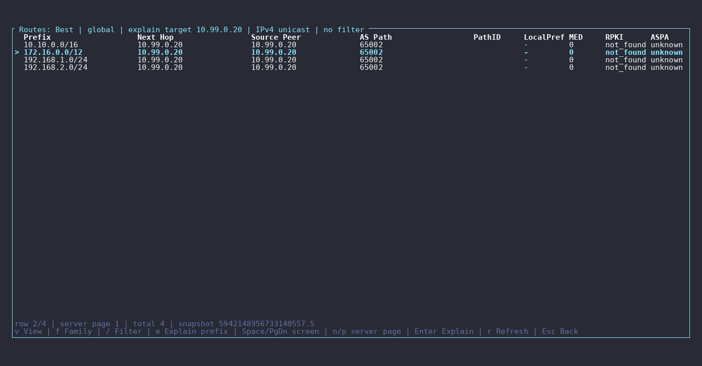

<p align="center">
  
</p>

# rustbgpd

[](https://github.com/lance0/rustbgpd/actions/workflows/ci.yml)
[](https://www.rust-lang.org)
[](LICENSE-MIT)

An API-first BGP daemon in Rust for IXP route servers, route reflectors, and
automation-heavy control planes. gRPC is the primary interface for all peer
lifecycle, routing, and policy operations — the config file bootstraps initial
state, then gRPC owns the truth. No restarts to add peers, change policy, or
inject routes. And every route decision can explain itself from the live RIB:
per-peer received / best / advertised views, best-path and export-gate
explain, opt-in import-decision explain, retained rejected routes with
reasons, BMP/MRT/metrics — with receipt-backed interop behind each claimed
behavior.

**Measured, not marketed** — every number below links to its published,
reproducible receipt:

- **Policy reload at IXP scale** (700 route-server clients × 400,400 routes,
  live churn, same harness / same host): new policy fully delivered to every
  member in **1.29–1.67 s p50** vs BIRD 3.3.1's 68–85 s and OpenBGPD 9.1's
  247–253 s — [IXP receipt matrix](docs/perf/ixp-matrix-2026-07.md)
- **Member-flap propagation** (50 members flap, 650 observers): re-announce
  p50 **0.46–0.49 s** vs BIRD's 2.7–3.7 s and OpenBGPD's 20.9–21.4 s;
  withdraw p50 0.25–0.48 s, also fastest — [same matrix](docs/perf/ixp-matrix-2026-07.md#s3--flapstorm-member-down--member-up-propagation)
- **Cold start**: full 400,400-route table delivered to all 700 members in
  **4.7–5.0 s** vs 61.6–65.3 s (BIRD) and 338.8–422.1 s (OpenBGPD) —
  [same matrix](docs/perf/ixp-matrix-2026-07.md#s1--cold-convergence)
- **Route-reflector scale**: 1,000 RR clients × 100k routes converge on the
  wire in **1.82 s** at **419 MiB** whole-process RSS — measured 2026-07-03
  at the close of the update-groups arc,
  [1000-peer scale receipt](docs/perf/scale-receipt-2026-07.md)
- **The losses, stated plainly**: OpenBGPD holds a smaller reload stall
  (p50 0.24–0.28 s vs rustbgpd's 0.42–0.73 s), and BIRD keeps the settled-RSS
  win under flap churn (337/292 MiB vs rustbgpd's 440/502 MiB at S3).
  rustbgpd edged BIRD in S2 settled RSS in these runs (412/410 vs
  425/417 MiB) after the explain-cache default change — a same-host pair of
  runs, not a universal memory win — published in the
  [same receipt](docs/perf/ixp-matrix-2026-07.md#memory), methodology and
  fairness protocol included

All matrix figures above are from the v0.61.0 same-host refresh (2026-07-27);
the original campaign, its bands, and both raw artifact sets are preserved in
the receipt.

**Status: public alpha.** Feature-complete for the initial programmable
control-plane target and expanding toward cloud / AI-scale data-center
fabric use.

> **Alpha expectations:** The config format and gRPC API are not yet frozen.
> Breaking changes are possible between minor versions. The daemon runs on
> Linux (the primary target); other platforms are not tested. See
> [Project Status](#project-status) for details.

## Try it (60 seconds)

The fastest way to see rustbgpd in action. Spins up the daemon with an FRR
peer that advertises sample IPv4 and IPv6 prefixes — no real routers needed.

```bash
cd examples/docker-compose
docker compose up -d --build
```

`--build` asks Compose to build from the current checkout before startup.
Without it, Compose may reuse an older `docker-compose-rustbgpd` image already
on the host. Cached layers keep unchanged repeat builds quick.

Once both containers are running (a few seconds):

The Compose service supplies its committed, public **test-only** bearer token
to in-container `rbgp` commands. It is for this runnable demo, not deployment.

```bash
# See the FRR peer come up
docker compose exec rustbgpd rbgp -s http://127.0.0.1:50051 summary

# Browse the RIB
docker compose exec rustbgpd rbgp -s http://127.0.0.1:50051 rib

# Live TUI dashboard — sessions, prefix counts, message rates
docker compose exec rustbgpd rbgp -s http://127.0.0.1:50051 top
```



Press `q` to exit the TUI. When you're done: `docker compose down`.

## Policy you can test before it touches a route

Policies are written in `.rpol` — a typed, compiled language with named
prefix/community sets (indexed matchers, not linear walks), parameterized
policies, composition, and unit tests **in the policy file itself**. From the
shipped [route-server example](examples/route-server/hygiene.rpol):

```rpol
policy ixp-hygiene {
    # AS_SETs are deprecated (RFC 9774); reject them like arouteserver does.
    term reject-as-set { if route.as-path matches "\\{" { reject } }
    term reject-aspa-invalid { if route.aspa == invalid { reject } }
    # Tag the RPKI outcome as an RFC 8097 extended community for members.
    term tag-ov-valid { if route.rpki == valid { add ext-community OV_VALID } }
}

test as-set-is-rejected {
    route { prefix 203.0.113.0/24; as-path "64501 {64502 64503}" }
    expect ixp-hygiene == reject
}
```

Then ask the daemon *what would happen* — before you commit anything:

<!-- rbgp-cli-conformance -->
```bash
rbgp policy check hygiene.rpol      # offline: compile + run the in-language tests
rbgp policy test hygiene.rpol --policy ixp-hygiene --direction import
                                    # read-only dry run against the LIVE RIB:
                                    # accept/reject/modify counts, per-term hits
rbgp rib --prefix 203.0.113.0/24 advertised 198.51.100.7 --explain
                                    # walk the real export gate ladder to one peer
rbgp policy stats                   # live per-term hit counters once installed
```

Edits hot-apply on SIGHUP, `.rpol` mixes freely with the existing TOML policy
chains, and FRR route-map parity is proven route-for-route in interop (M80).
Language reference: [docs/rpol-language.md](docs/rpol-language.md) · explain
surfaces: [docs/explain.md](docs/explain.md) · IXPs on arouteserver can render
config from their existing `general.yml`/`clients.yml`:
[IXP filter-pipeline tutorial](docs/cookbook/ixp-filter-pipeline.md).

## Why rustbgpd

- **API-first control plane** — full gRPC surface across twelve services
  (eleven native `rustbgpd.v1` services plus the OpenConfig `gnmi.gNMI`
  service) and a thin CLI (`rbgp`): dynamic peer management, policy CRUD,
  route injection, streaming events, all without restarts
- **Native route explainability** — "why is this route (not) here?" answered
  from the live RIB in one command, where incumbents need an external
  looking-glass stack for less. Best-path, export-gate, and filtered-route
  views are always on; the **import**-decision surface is opt-in
  (`[policy.explain] enabled = true`), because it retains a decision cache
  per session ([docs/explain.md](docs/explain.md))
- **Update-group fanout** — peers with provably identical staged output share
  one staging pass: ~28x faster 100k-route convergence at 256 uniform RR
  clients (15.1 s to 0.54 s); v2 extends sharing to VPNv4/v6 with per-member
  RT filtering at emit ([receipt](docs/perf/scale-receipt-2026-07.md))
- **Full BMP monitoring trio** — per-collector Adj-RIB-In / Adj-RIB-Out
  (byte-exact wire PDUs) / Loc-RIB on one exporter, validated against pmacct,
  gobmp, and tshark at once
- **Modern protocol surface** — MP-BGP, Add-Path, GR/LLGR, RPKI/RTR + ASPA,
  FlowSpec, Prefix ORF, large/extended communities — plus VPNv4/v6, RT-Constrain,
  labeled-unicast, and BGP-LS reflection, and **RFC 9107 Optimal Route
  Reflection** (per-client best paths via SPF over BGP-LS topology — a
  capability no other open-source BGP daemon ships)
- **Explicit architecture** — pure FSM with no I/O, single-owner RIB with no
  locks, bounded channels; no `Arc<RwLock>` on routing state
  ([ARCHITECTURE.md](ARCHITECTURE.md))
- **Reusable crates** — `rustbgpd-wire` (zero internal deps) and
  `rustbgpd-fsm` are published for BGP tooling that doesn't need the router

The full-depth version of each item — the complete observability surface, the
BMP/BMPv4 details, the ADR-0077 route-reflector family boundary, the VPN
fanout numbers — is the [feature tour](docs/feature-tour.md).

## Good fit

- **Internet exchange route servers** — transparent mode, Add-Path, per-client
  best-path (RFC 7947 path-hiding mitigation), RPKI, Prefix ORF, per-member policy
- **Route reflectors** — including VPNv4/v6, RT-Constrain, labeled-unicast, and
  BGP-LS reflection, GR/LLGR, and RFC 9107 Optimal Route Reflection
- **DDoS mitigation platforms** — FlowSpec + RTBH route injection from automation
- **Cloud / AI-scale data-center fabrics** — API-first BGP control, BFD, ECMP,
  EVPN/VXLAN alpha, and whitebox-friendly interop surfaces
- **Hosting provider prefix management** — API-driven customer prefix announcements
- **SDN / network automation controllers** — programmable BGP control plane
- **Route collectors and looking glasses** — structured data via gRPC, MRT, BMP,
  plus a Birdwatcher-shaped status/peer/accepted/filtered/noexport subset via
  the external `examples/birdwatcher-adapter`
- **Lab and test environments** — clean API, structured logs, containerlab interop

See [docs/USE_CASES.md](docs/USE_CASES.md) for detailed deployment scenarios with
architecture diagrams, example configs, and API workflows, and the
[feature tour](docs/feature-tour.md#route-reflector-families-beyond-unicast)
for exactly which route-reflector families have shipped and where the
ADR-0077 scope boundary sits.

## Not the best fit today

- Full general-purpose router deployments expecting default-on,
  fully policy-guarded FIB integration — Linux FIB integration is default-off
  and scoped to RFC 7999 discard routes and configured unicast tables
  (including ECMP and weighted multipath)
- Large-scale production EVPN fabrics that need the full feature
  surface — VXLAN EVPN is functional and FRR-interop-tested but still
  **alpha**. VXLAN local-bias split-horizon remains the one open
  all-active correctness gate (ASIC/offload-dependent on the Linux
  softswitch — see ADR-0065); service-provider EVPN families such as
  MPLS / PBB / MVPN are deliberately out of the current VXLAN/Linux
  lane. See [Current limitations](#current-limitations) for the alpha
  boundary and [docs/evpn-enablement.md](docs/evpn-enablement.md) for
  the shipped feature ladder and standards-tail map
- VPNv4 / VPNv6 PE roles — VRF import, MPLS label forwarding, and CE-facing
  attachment circuits are out of scope; the shipped SAFI-128 support is the
  route-reflector / controller-feed slice only
- Environments that need the breadth of FRR's multi-decade feature surface
- Operators who want a CLI-first operational model

See [docs/COMPARISON.md](docs/COMPARISON.md) for a detailed feature comparison
with FRR, BIRD, GoBGP, and OpenBGPd.

## Install

### Pre-built tarball (no toolchain required)

Every tagged release ships static-named per-arch tarballs, so
`releases/latest/download/` always fetches the current version:

```bash
SUFFIX=linux-amd64   # or linux-arm64
curl -fLO "https://github.com/lance0/rustbgpd/releases/latest/download/rustbgpd-${SUFFIX}.tar.gz"
curl -fLO "https://github.com/lance0/rustbgpd/releases/latest/download/checksums-${SUFFIX}.txt"
sha256sum -c "checksums-${SUFFIX}.txt"
tar -xzf "rustbgpd-${SUFFIX}.tar.gz"
sudo install -m 0755 rustbgpd rbgp rs-config-render /usr/local/bin/
```

Three binaries: the daemon, the `rbgp` CLI, and `rs-config-render` (the
[IXP route-server config renderer](tools/rs-config-render/README.md) —
harmless if you don't run one). The tarball also carries man pages and
bash/zsh/fish completions under `share/` — the
[install walkthrough](docs/deployment.md#install) covers installing those
and pinning a specific version.

### From source

```bash
# Prerequisites: Rust 1.95+, protobuf-compiler
sudo apt-get install -y protobuf-compiler   # Debian/Ubuntu
cargo build --release -p rustbgpd -p rustbgpctl -p rs-config-render

# Binaries are at target/release/{rustbgpd,rbgp,rs-config-render}
```

### Docker

Release images are published to GHCR (versioned tags, e.g.
`ghcr.io/lance0/rustbgpd:0.61.0`), or build locally:

```bash
docker build -t rustbgpd .                    # lean runtime: daemon + rbgp, nonroot
docker build --target dev -t rustbgpd:dev .   # dev/interop image (lab helpers, root)
```

## Quick start (bare metal)

For running rustbgpd on a real host with real peers, see
[docs/QUICKSTART.md](docs/QUICKSTART.md). It covers starter config generation,
`--check` / `--diff`, local UDS access, HTTP probes, runtime peer operations,
remote mTLS access, standalone Docker, and systemd.

The [cookbook](docs/cookbook/README.md) has complete receipt-proven recipes for
the common deployment shapes: iBGP route reflector at scale, L3VPN reflection,
IXP route server, BMP/event/MRT monitoring feed, EVPN fabric RR, and `.rpol`
policy. IXPs running arouteserver can render rustbgpd configuration from their
existing `general.yml`/`clients.yml` and wire up an Alice-LG looking glass —
the [IXP filter-pipeline tutorial](docs/cookbook/ixp-filter-pipeline.md) walks
it end to end.

For operators coming from FRR, BIRD, or ARouteServer, the CLI keeps familiar
entry points for the daily checks: `rbgp summary`, `rbgp rib recv <peer>`,
`rbgp rib sent <peer>`, `rbgp policy counters`, and `rbgp doctor` for a
redacted support bundle. See the [CLI command map](crates/cli/README.md).

## Performance vs the incumbents

The [IXP route-server receipt matrix](docs/perf/ixp-matrix-2026-07.md) runs
rustbgpd, BIRD 3.3.1, and OpenBGPD 9.1 through **the same harness on the same
host** — 700 route-server clients × 400,400 routes with live churn, each
incumbent at its documented strongest configuration, receiver-side timestamps,
two independent campaign runs, losses published alongside wins:

| KPI (700 clients × 400,400 routes, p50) | rustbgpd | BIRD 3.3.1 | OpenBGPD 9.1 |
|---|---|---|---|
| Sessions Established | **0.7 s** | 18.4–20.8 s | 66.7–155.7 s |
| Cold start, full table to all members | **4.7–5.0 s** | 61.6–65.3 s | 338.8–422.1 s |
| Reload: UPDATE stall | 0.42–0.73 s | 1.74–2.68 s | **0.24–0.28 s** |
| Reload: new policy fully delivered | **1.29–1.67 s** | 68–85 s | 247–253 s |
| Flapstorm: withdraw propagation | **0.25–0.48 s** | 0.38–0.57 s | 10.3–12.6 s |
| Flapstorm: re-announce | **0.46–0.49 s** | 2.7–3.7 s | 20.9–21.4 s |
| Settled RSS (S2, runs A/B) | **412 / 410 MiB** | 425 / 417 MiB | 768 / 773 MiB |
| Settled RSS (S3, runs A/B) | 440 / 502 MiB | **337 / 292 MiB** | 824 / 821 MiB |

Figures are the v0.61.0 same-host refresh (2026-07-27); the original
campaign's tables and artifacts are preserved unchanged in the receipt.
rustbgpd is the only daemon in the matrix holding both a sub-second median
stall **and** single-digit-seconds completion; OpenBGPD has the smallest
stall at every scale rung; the settled-memory picture is split — rustbgpd
edged BIRD at S2 in these runs after the explain-cache default change,
while BIRD's S3 advantage remains clear. The receipt includes the full
method, configuration disclosure, honesty notes, raw artifacts — and a
post-publication note where the receipt's own tables exposed a rustbgpd
re-announce plateau that was root-caused, fixed, and rerun (9.5–9.8 s →
0.46–0.49 s).

At route-reflector shapes, the
[1000-peer scale receipt](docs/perf/scale-receipt-2026-07.md) measures 1,000
uniform RR clients × 100k routes converging on the wire in 1.82 s at 419 MiB
whole-process RSS, and 1,000 clients × 100k VPNv4 in 12.60 s / 625 MiB uniform
and 3.92 s / 636 MiB with heterogeneous ~10% RT memberships (vs ~73 s / ~31 GiB
and ~12.5 s / ~5.7 GiB extrapolated per-peer), with a one-RT membership flip
delivering its 1600-route delta in ~15 ms with zero policy evaluations.

Microbenchmarks, memory scaling, and the bgperf2 cross-daemon comparison:
[docs/BENCHMARKS.md](docs/BENCHMARKS.md). Every receipt is indexed in
[docs/RECEIPTS.md](docs/RECEIPTS.md); GoBGP-specific parity is in
[docs/gobgp-parity.md](docs/gobgp-parity.md).

## gRPC API

Eleven native `rustbgpd.v1` services cover the daemon's operational surface —
Global, Config, Neighbor, Policy (22 RPCs including explain, dry-run, and
per-term stats), PeerGroup, Rib, BFD, Event, Injection, Control, and Evpn —
plus a separate `gnmi.gNMI` service for OpenConfig BGP telemetry and the first
transaction-backed config subset.

```bash
# Stream route changes in real time over the default UDS listener
grpcurl -plaintext -unix /var/lib/rustbgpd/grpc.sock \
  -import-path . -proto proto/rustbgpd.proto \
  rustbgpd.v1.RibService/WatchRoutes
```

Config changes get the full Junos-style transactional quartet: `rbgp config
plan` (commit check), `rbgp config diff` (show compare, annotated with live
reload impact), `rbgp config apply --confirm-id --confirm-timeout` (commit
confirmed, with a crash-safe boot revert), and `rbgp config rollback N`
against a bounded on-disk history of applied configs — rollback routes
through the same transaction engine as apply, so it gets the same impact
preview, receipts, and confirm window. Details:
[docs/OPERATIONS.md](docs/OPERATIONS.md).

The full service/RPC table and per-RPC examples: [docs/API.md](docs/API.md).
gNMI operator guide: [docs/GNMI.md](docs/GNMI.md).

## Design choices

rustbgpd is intentionally built around:

- **gRPC-driven control** instead of a large interactive CLI surface
- **A pure FSM crate** with no I/O — `(State, Event) -> (State, Vec<Action>)`
- **Single-owner routing state** instead of shared mutable state across tasks
- **Bounded channels** for all inter-task communication — backpressure, not locks
- **Explicit protocol feature boundaries** with ADRs and test-backed development

Designed around an API-first operating model similar to GoBGP, with a smaller
and more explicit internal architecture. Rationale:
[docs/DESIGN.md](docs/DESIGN.md); crate graph and runtime model:
[ARCHITECTURE.md](ARCHITECTURE.md).

## Deployment examples

| Example | Description |
|---------|-------------|
| [`examples/docker-compose/`](examples/docker-compose/) | Quick-start with Docker Compose — rustbgpd + FRR peer with sample routes |
| [`examples/minimal/`](examples/minimal/) | Smallest working config — single eBGP peer |
| [`examples/route-server/`](examples/route-server/) | IXP route server with RPKI, Add-Path + per-client best-path, rpol hygiene policy |
| [`examples/ddos-mitigation/`](examples/ddos-mitigation/) | FlowSpec + RTBH for automated DDoS mitigation |
| [`examples/hosting-provider/`](examples/hosting-provider/) | iBGP route injector for customer prefix management |
| [`examples/linux-edge-fib/`](examples/linux-edge-fib/) | Linux edge host with explicit ADR-0061 `[[fib_tables]]` unicast FIB programming |
| [`examples/route-collector/`](examples/route-collector/) | Passive collector with MRT dumps and BMP export |
| [`examples/rr-evpn-fabric/`](examples/rr-evpn-fabric/) | EVPN Route Reflector for a VXLAN-EVPN DC fabric (RFC 7432, RR role) |
| [`examples/evpn-vtep-leaf/`](examples/evpn-vtep-leaf/) | Leaf VTEP with local `[[evpn_instances]]` declarations (declarative EVPN instance schema) |
| [`examples/envoy-mtls/`](examples/envoy-mtls/) | Remote gRPC access via Envoy mTLS proxy |
| [`examples/systemd/`](examples/systemd/) | systemd unit file with security hardening |

## Security posture

- **Default listener:** Unix domain socket at `/var/lib/rustbgpd/grpc.sock` — local-only, no TCP exposure
- **Optional read-only listeners:** expose monitoring/query RPCs without exposing mutating control RPCs
- **Remote access:** native gRPC mTLS on the TCP listener (`tls_cert_file` / `tls_key_file` / `tls_client_ca_file`), or an Envoy mTLS proxy front-end for multi-host fan-out — never plaintext TCP off-host
- **Network controls:** put gRPC on a management VLAN/interface and firewall it to known hosts

Full guidance and deployment tiers: [docs/SECURITY.md](docs/SECURITY.md).

## Testing and correctness

Evidence-driven development: fuzz targets on the wire decoder, property tests
on the FSM, automated containerlab interop, extensive workspace tests, and an
architecture decision record for every protocol and design choice.

| Evidence | Details |
|----------|---------|
| Workspace tests | Unit, integration, and property tests (`cargo test --workspace`) |
| Wire fuzzing | libFuzzer harnesses on message and attribute decoders, run nightly in CI |
| Interop suites | Automated interop suite (see [docs/INTEROP.md](docs/INTEROP.md) for the full matrix), primarily against FRR 10.3.1 plus GoBGP 3.37.0–4.6.0 across labs and StayRTR-backed RTR coverage; BIRD 2.0.12 covers M0 and BIRD 3.3.1 covers the TCP-AO smoke. A foundation tier is gated on every PR, privileged Linux dataplane smokes run in hosted kernel-dataplane CI, and longer soaks / platform-diversity scripts remain local. |
| Operational proof | Consolidated receipts for CI interop, hosted kernel dataplane, benchmarks, memory profiles, and archived 24 h soaks live in [docs/OPERATIONAL_PROOF.md](docs/OPERATIONAL_PROOF.md). |
| Protocol coverage | [Supported standards at a glance](docs/RFC_NOTES.md#supported-standards-at-a-glance) plus per-RFC conformance notes in [docs/RFC_NOTES.md](docs/RFC_NOTES.md); interop matrix in [docs/INTEROP.md](docs/INTEROP.md) and receipts in [docs/RECEIPTS.md](docs/RECEIPTS.md). |
| Architecture decisions | ADRs documenting every protocol and design choice ([docs/adr/](docs/adr/)) |

```bash
# Run interop tests
containerlab deploy -t tests/interop/m4-frr.clab.yml
bash tests/interop/scripts/test-m4-frr.sh
```

See [docs/INTEROP.md](docs/INTEROP.md) for full procedures and results.

## Current limitations

The short version: rustbgpd is still not a general-purpose router replacement.
Linux FIB integration is opt-in, EVPN is Linux/VXLAN alpha, VPNv4/VPNv6 is RR /
controller-feed only, and a few transport/runtime edges remain deliberately
scoped. See [docs/LIMITATIONS.md](docs/LIMITATIONS.md) for the full boundary.

## Project status

**Alpha — suitable for lab, data-center fabric pilots, IX route-server pilots,
and programmable control-plane deployments where you are comfortable with an
evolving API.**

| Dimension | Current state |
|-----------|---------------|
| **Target use case** | Data-center fabric pilots, IXP route servers, programmable BGP control planes, lab/test environments |
| **Maturity** | Public alpha (v0.62.0) |
| **Adopter support** | Reporting channels, compatibility boundaries, and proof limits are documented in [SUPPORT.md](SUPPORT.md). |
| **Narrow stable contract** | The machine-pinned [route-server / route-reflector v1 contract](docs/v1-stable-contract.md) covers only its inventoried control-plane roles and surfaces; the project and all unlisted features remain alpha. |
| **Implemented** | Dual-stack BGP/MP-BGP, Add-Path, GR/LLGR, RPKI/RTR, ASPA path verification, FlowSpec, BMP, MRT, BFD, EVPN/VXLAN (alpha), and full gRPC/CLI management. Linux FIB integration is default-off and scoped to RFC 7999 discard routes and configured unicast tables (including ECMP and weighted multipath); broader routing-suite features remain future work. |
| **Supported OS** | Linux (primary target). Requires `CAP_NET_BIND_SERVICE` for port 179. |
| **Runtime** | Rust 1.95+ (workspace MSRV — set by the bundled SQLite build), single binary, no external dependencies except optional RPKI/BMP/MRT backends |
| **Config stability** | Inventoried RS/RR v1 fields follow the narrow compatibility policy; unlisted TOML may change between minor versions with migrations documented in CHANGELOG. |
| **API stability** | Inventoried native gRPC/CLI/JSON surfaces follow the narrow v1 policy; unlisted API remains alpha and may evolve between minor versions. |
| **Not yet supported** | EVPN runtime L3VNI/device/table IP-VRF identity changes (restart-required by design), true RFC VLAN-aware bundle VTEP origination + dataplane (non-zero Ethernet Tag RR receive/reflect shipped, M82), EVPN route types 6-11 / PBB / MVPN / MPLS/SRv6 service encapsulation, BGP-LS local topology production, Confederation, TCP-AO key edits/reordering or runtime protected-range CRUD (ordered keyrings, add-only successor installation, observation-gated successor selection/deprecation, and later deprecated/unselected-key deletion on SIGHUP are supported) |
| **Tests** | Workspace test suite, fuzz targets, an automated interop suite (see [docs/INTEROP.md](docs/INTEROP.md)) primarily against FRR plus GoBGP / StayRTR / documented BIRD coverage, and an in-tree EVPN load generator (foundation tier gated on every PR; privileged kernel dataplane smokes run on GitHub-hosted CI) |

## Documentation

| Document | Content |
|----------|---------|
| [docs/feature-tour.md](docs/feature-tour.md) | The full-depth feature tour behind the README highlights |
| [docs/cookbook/](docs/cookbook/README.md) | Scenario recipes with receipt-proven configs: RR at scale, L3VPN RR, IXP route server, monitoring feed, EVPN fabric RR, policy quickstart |
| [docs/USE_CASES.md](docs/USE_CASES.md) | Deployment scenarios: DDoS, hosting, IX, SDN, collector |
| [ARCHITECTURE.md](ARCHITECTURE.md) | Crate graph, runtime model, ownership, data flow |
| [docs/DESIGN.md](docs/DESIGN.md) | Tradeoffs, protocol scope, rationale |
| [docs/API.md](docs/API.md) | gRPC API reference with examples for every RPC |
| [docs/CONFIGURATION.md](docs/CONFIGURATION.md) | Config reference and examples, plus editor integration via the shipped JSON Schema (`docs/rustbgpd.schema.json`) |
| [docs/QUICKSTART.md](docs/QUICKSTART.md) | Bare-metal first run: starter config, validate, run, verify, operate |
| [docs/LIMITATIONS.md](docs/LIMITATIONS.md) | Current product boundaries and known non-goals |
| [docs/deployment.md](docs/deployment.md) | End-to-end install + lifecycle walkthrough: systemd, Docker, containerlab quick-start, upgrade, sample profiles |
| [docs/reload-matrix.md](docs/reload-matrix.md) | Per-field reload classification: which keys hot-apply, which need a restart, which are rejected at parse time |
| [docs/OPERATIONS.md](docs/OPERATIONS.md) | Running in production: reload, upgrade, failure modes, debugging |
| [docs/explain.md](docs/explain.md) | The explain surfaces: why a route was selected, advertised, imported, or rejected |
| [docs/SECURITY.md](docs/SECURITY.md) | Security posture, firewall guidance, deployment tiers |
| [docs/BENCHMARKS.md](docs/BENCHMARKS.md) | Wire codec and RIB performance numbers, scaling analysis |
| [docs/OPERATIONAL_PROOF.md](docs/OPERATIONAL_PROOF.md) | Consolidated operational proof receipts: CI interop, dataplane, benchmarks, memory, soak |
| [docs/RECEIPTS.md](docs/RECEIPTS.md) | Full receipts index: every M-series interop lab, perf/scale receipt, archived soak, and CI schedule |
| [docs/GRAFANA.md](docs/GRAFANA.md) | Grafana overview dashboard: import instructions and Prometheus scrape config |
| [docs/COMPARISON.md](docs/COMPARISON.md) | Feature comparison with FRR, BIRD, GoBGP, OpenBGPd |
| [docs/INTEROP.md](docs/INTEROP.md) | Interop test coverage and results |
| [docs/evpn-enablement.md](docs/evpn-enablement.md) | EVPN Phase 1-9 gate ladder: what each gate unlocks, work per gate, priority |
| [docs/evpn-vtep-setup.md](docs/evpn-vtep-setup.md) | EVPN VTEP kernel setup: `ip link` recipes for L2VNI / IP-VRF / multi-homing mapped to the ADR-0054 §4 + ADR-0058 §3 readiness checks (operator-provisioned netdevs) |
| [docs/evpn-vtep-troubleshooting.md](docs/evpn-vtep-troubleshooting.md) | EVPN VTEP alpha troubleshooting runbook |
| [docs/gobgp-parity.md](docs/gobgp-parity.md) | rustbgpd vs GoBGP feature parity by use case |
| [docs/adr/](docs/adr/) | Architecture decision records — one per protocol and design choice |
| [docs/RELEASE_CHECKLIST.md](docs/RELEASE_CHECKLIST.md) | Pre-release smoke matrix and release steps |
| [docs/v1-stable-contract.md](docs/v1-stable-contract.md) | Narrow machine-pinned v1 compatibility contract for proven route-server / route-reflector roles |
| [ROADMAP.md](ROADMAP.md) | Remaining gaps and planned work |
| [CHANGELOG.md](CHANGELOG.md) | Release history |
| [CONTRIBUTING.md](CONTRIBUTING.md) | Development setup, code style, PR process |

## License

Licensed under either of

- Apache License, Version 2.0 ([LICENSE-APACHE](LICENSE-APACHE) or <http://www.apache.org/licenses/LICENSE-2.0>)
- MIT license ([LICENSE-MIT](LICENSE-MIT) or <http://opensource.org/licenses/MIT>)

at your option.

### Contribution

Unless you explicitly state otherwise, any contribution intentionally submitted
for inclusion in the work by you, as defined in the Apache-2.0 license, shall be
dual licensed as above, without any additional terms or conditions.
