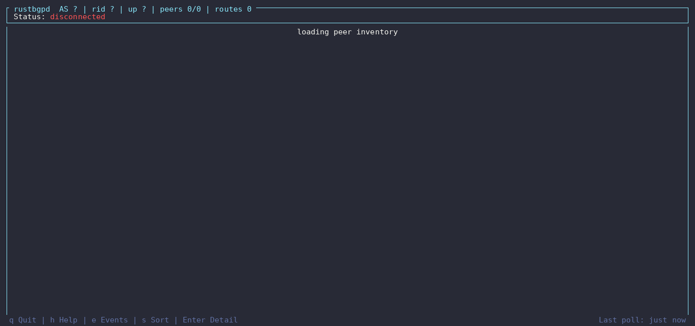

<p align="center">
  
  
</p>

# rustbgpd

[](https://github.com/lance0/rustbgpd/actions/workflows/ci.yml)
[](LICENSE-MIT)

**An API-first BGP daemon in Rust for route servers, route reflectors, and network automation.**

Manage peers, apply policy, and inject routes through gRPC or the `rbgp` CLI.
Inspect unicast route decisions from the live RIB, test policies before applying
them, and stream routing events to your own tools.

[Documentation](docs/README.md) · [Install](#install) ·
[Releases](https://github.com/lance0/rustbgpd/releases) · [Website](https://rbgp.rs)

<a id="project-status"></a>

**Stability:** inventoried IPv4/IPv6 unicast route-server and route-reflector
surfaces have a [narrow v1 compatibility contract](docs/reference/v1-stable-contract.md),
with baseline v0.68.0. The project remains alpha overall; unlisted surfaces,
EVPN, and Linux dataplane features are outside that promise.
[Stability and compatibility](docs/reference/stability.md) explains the boundaries.

## Choose your path

<a id="good-fit"></a>

### IXP route server

IPv4/IPv6 unicast, per-member policy, RPKI, and Add-Path. Inventoried surfaces
are covered by the narrow v1 contract.

[Evaluate](docs/explanation/ixp-evaluation.md) · [Deploy](docs/cookbook/route-server.md) ·
[Shadow pilot](docs/cookbook/route-server-shadow-pilot.md)

### Route reflector

IPv4/IPv6 unicast under the narrow v1 contract. VPN, labeled-unicast,
RT-Constrain, and BGP-LS reflection have separate, scoped support; EVPN
remains alpha.

[Deploy](docs/cookbook/route-reflector.md) ·
[Family boundaries](docs/explanation/feature-tour.md#route-reflector-families-beyond-unicast)

### Monitoring and automation

BMP/MRT feeds, route injection, FlowSpec, and gRPC integration. Shipped
capabilities have individual limits; support does not imply v1 stability.

[Monitoring recipe](docs/cookbook/monitoring-feed.md) · [API reference](docs/reference/api.md) ·
[DDoS example](examples/ddos-mitigation/config.toml)

<a id="not-the-best-fit-today"></a>
<a id="current-limitations"></a>

Linux FIB integration is opt-in. VPN reflection does not provide PE/VRF or
MPLS forwarding, and rustbgpd does not provide a full multi-protocol routing
suite. Check the [current limitations](docs/reference/limitations.md) for your role.

## Try it locally

<a id="try-it-60-seconds"></a>

With Git and Docker Compose installed, start rustbgpd and an FRR peer that
advertises sample IPv4 and IPv6 routes. The first run builds the daemon from
source; subsequent runs reuse cached build layers.

```bash
git clone https://github.com/lance0/rustbgpd
cd rustbgpd/examples/docker-compose
docker compose up -d --build
```

The demo supplies a public **test-only** bearer token to in-container `rbgp`
commands. Once the containers are running, check the session and open the TUI:

```bash
docker compose exec rustbgpd rbgp -s http://127.0.0.1:50051 summary
docker compose exec rustbgpd rbgp -s http://127.0.0.1:50051 top
```



Select the FRR peer, open its detail, then press `r` to explore its unicast
Best, Received, Advertised, and Rejected tables and explain export decisions.
Press `q` to exit. You can also explain a sample route directly:

```bash
docker compose exec rustbgpd rbgp -s http://127.0.0.1:50051 rib --prefix 192.168.1.0/24 --explain
```

When finished, run `docker compose down`. The [demo guide](examples/docker-compose/README.md)
covers more commands and resetting its persistent state.

## Policy you can test before it touches a route

<a id="why-rustbgpd"></a>

Write policies in `.rpol` with named prefix/community sets, composition, and
unit tests in the policy file. Compile them offline, then dry-run a candidate
against an installed daemon's live RIB before applying it.

From the repository root, using the shipped [route-server policy](examples/route-server/hygiene.rpol):

<!-- rbgp-cli-conformance -->
```bash
rbgp policy check examples/route-server/hygiene.rpol
rbgp policy test examples/route-server/hygiene.rpol --policy ixp-hygiene --direction import
rbgp rib --prefix 203.0.113.0/24 advertised 198.51.100.7 --explain
rbgp policy stats
```

The live commands use your installed daemon's local socket by default;
substitute your prefix and peer for the export example. Import-decision
explain requires `[policy.explain] enabled = true`; unicast best-path and
export-gate explain need no decision cache.

[Policy language](docs/reference/rpol-language.md) · [Route explainability](docs/how-to/explain.md) ·
[Feature tour](docs/explanation/feature-tour.md)

## Install

<a id="pre-built-tarball-no-toolchain-required"></a>
<a id="from-source"></a>
<a id="docker"></a>
<a id="quick-start-bare-metal"></a>

The daemon supports **Linux x86_64 and aarch64**. Releases provide tarballs,
Debian/RPM packages, and container images; consult the
[platform support contract](SUPPORT.md#platform-support) and the
[installation guide](docs/how-to/deployment.md#install) for platform requirements,
checksum verification, and image architecture availability.

- **Install a release:** follow the [deployment guide](docs/how-to/deployment.md#install)
  for packages, tarballs, Docker, and systemd.
- **Build from source:** follow [Contributing](CONTRIBUTING.md#development-setup)
  for the Rust toolchain and build prerequisites.
- **Configure real peers:** start with the [host quickstart](docs/tutorials/quickstart.md)
  or a [scenario recipe](docs/cookbook/README.md).

<a id="security-posture"></a>

The default gRPC listener is a local Unix socket. For remote administration,
use the documented [mTLS and authorization setup](docs/reference/security.md).

## Documentation

<a id="grpc-api"></a>
<a id="design-choices"></a>
<a id="deployment-examples"></a>
<a id="testing-and-correctness"></a>
<a id="performance-vs-the-incumbents"></a>

Start with the [documentation index](docs/README.md), or go directly to your task:

| Task | Guide |
|------|-------|
| Configure, operate, or upgrade | [Configuration](docs/reference/configuration.md) · [Operations](docs/reference/operations.md) · [Deployment](docs/how-to/deployment.md) |
| Automate or embed | [gRPC API](docs/reference/api.md) · [gNMI](docs/reference/gnmi.md) · [Rust libraries](docs/reference/embedding.md) |
| Evaluate the evidence | [Performance results](docs/perf/README.md) · [Operational proof](docs/operational-proof.md) · [Interop and receipts](docs/receipts.md) |
| Understand or contribute | [Architecture](docs/explanation/architecture.md) · [Contributing](CONTRIBUTING.md) · [Roadmap](docs/project/roadmap.md) |
| Check compatibility or get help | [Stability](docs/reference/stability.md) · [Support](SUPPORT.md) · [Security reporting](SECURITY.md) |

## License

Licensed under either of

- Apache License, Version 2.0 ([LICENSE-APACHE](LICENSE-APACHE) or <http://www.apache.org/licenses/LICENSE-2.0>)
- MIT license ([LICENSE-MIT](LICENSE-MIT) or <http://opensource.org/licenses/MIT>)

at your option.

### Contribution

Unless you explicitly state otherwise, any contribution intentionally submitted
for inclusion in the work by you, as defined in the Apache-2.0 license, shall be
dual licensed as above, without any additional terms or conditions.
