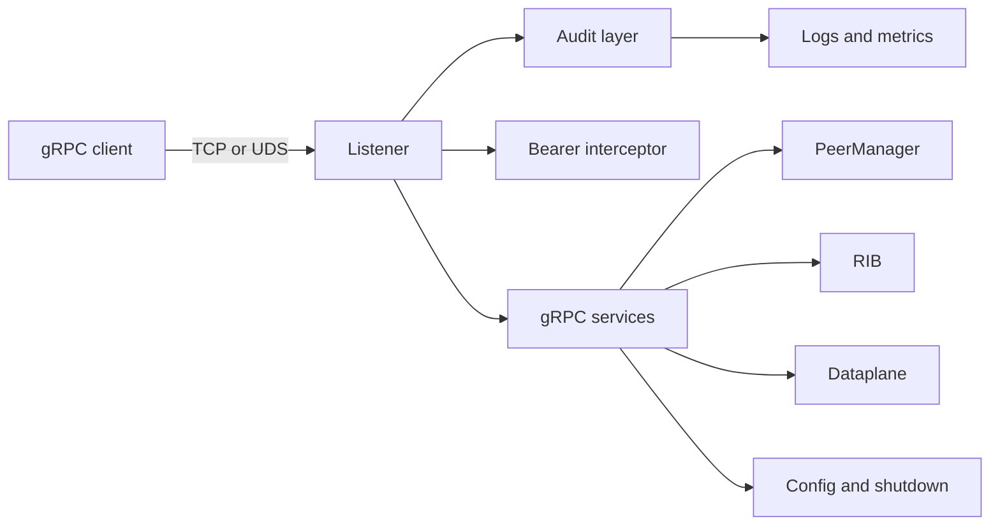

# ADR-0064 gRPC authorization threat model

**Status:** Draft audit packet
**Date:** 2026-05-18
**Scope:** gRPC management-plane authentication, authorization, audit logging,
and per-method tier enforcement for rustbgpd v1.0 readiness.

This packet is written for security reviewers. It consolidates the current
gRPC security posture, the ADR-0064 method-tier model, shipped runtime
evidence, enforced listener tier caps, and the remaining enforcement gaps.

External context:

- gRPC supports TLS/mTLS and metadata-based credentials as normal
  authentication mechanisms: <https://grpc.io/docs/guides/auth/>.
- gRPC interceptors are per-call hooks suitable for authorization-style checks:
  <https://grpc.io/docs/guides/interceptors/>.
- OWASP API Security Top 10 2023 keeps broken authorization and authentication
  as primary API review concerns:
  <https://owasp.org/API-Security/editions/2023/en/0x00-header/>.
- NIST SP 800-207's least-privilege, per-request access framing matches the
  ADR-0064 per-method tier direction:
  <https://doi.org/10.6028/NIST.SP.800-207>.

## Executive summary

The highest-risk area is the privileged gRPC management surface. rustbgpd
already has safe listener defaults, optional bearer-token auth, native mTLS,
UDS permissions, read-only listener mode, a checked 66-RPC method-tier matrix,
runtime tier telemetry, and enforced listener `max_tier` caps. The remaining
v1.0 security work is to turn that matrix into real principal-aware
enforcement: extract mTLS principals, assign roles, deny over-role calls, and
harden audit records so credential-bearing inputs are masked and outcomes are
captured.

## Scope and assumptions

In scope:

- gRPC listener configuration and runtime server wiring:
  `src/config/schema.rs`, `src/config/validation.rs`,
  `crates/api/src/server.rs`.
- Current listener-level authentication/authorization controls:
  UDS permissions, bearer-token interceptor, mTLS server setup, and
  `access_mode`.
- ADR-0064 method-tier inventory and runtime tier-decision layer:
  `docs/grpc-method-inventory.md`, `crates/api/src/authz.rs`,
  `crates/api/src/authz_runtime.rs`, and
  `crates/telemetry/src/metrics.rs`.
- gRPC services and high-risk RPCs in `proto/rustbgpd.proto` and
  `crates/api/src/*_service.rs`.
- Documentation and operator guidance: `docs/API.md`, `docs/SECURITY.md`,
  `docs/CONFIGURATION.md`, and `docs/RELEASE_CHECKLIST.md`.

Out of scope:

- BGP wire-protocol parser memory safety and route-decode correctness.
- Linux EVPN/FIB dataplane netlink correctness except where gRPC can trigger
  route injection or status disclosure.
- CI/build supply-chain threat modeling.
- Live production incident response and organization-specific PKI/IAM policy.

Assumptions:

- A production operator may expose gRPC on a management network, not the public
  Internet, but a non-loopback listener is possible and documented.
- The default UDS listener at the runtime state directory is the safest common
  deployment posture.
- The same accepted gRPC credential currently sees the whole read-write surface
  unless constrained by listener `access_mode`.
- Route injection, FlowSpec injection, EVPN injection, MRT dump, graceful
  shutdown, and process shutdown are high-blast-radius operations.
- This draft is produced without user clarification to keep the long-form goal
  moving; assumptions above should be confirmed before an external review.

Open questions that could change risk ranking:

- Are any deployments intentionally exposing read-write gRPC over routable TCP
  without mTLS?
- Do operators need bearer-token and UDS principals before mTLS principal
  extraction to support their real automation?
- What log sink and retention policy should count as an acceptable durable
  audit trail?

## System model

### Primary components

| Component | Role | Evidence |
|-----------|------|----------|
| Config loader | Parses listener config, token files, TLS file paths, and access mode | `src/config/schema.rs`, `src/config/validation.rs` |
| gRPC TCP listener | Optional TCP management endpoint with optional bearer token and optional mTLS | `crates/api/src/server.rs::run_tcp_listener` |
| gRPC UDS listener | Local management endpoint protected by filesystem permissions and optional bearer token | `crates/api/src/server.rs::run_uds_listener` |
| Bearer interceptor | Per-call token check for listeners with `token_file` | `crates/api/src/server.rs::AuthInterceptor` |
| Service handlers | Implement Global, Config, Neighbor, Policy, PeerGroup, RIB, Event, Injection, Control, and EVPN RPCs | `proto/rustbgpd.proto`, `crates/api/src/*_service.rs` |
| Access mode guard | Per-service mutating RPC rejection on read-only listeners | `crates/api/src/server.rs::read_only_rejection` |
| Method-tier matrix | Static ADR-0064 classification for all 66 RPCs | `crates/api/src/authz.rs`, `docs/grpc-method-inventory.md`, `docs/grpc-method-inventory.json` |
| Audit runtime layer | Audit-only method-tier lookup, structured logs, bounded metric | `crates/api/src/authz_runtime.rs`, `crates/telemetry/src/metrics.rs` |
| Core actors | PeerManager, RIB, dataplane, config persistence, and shutdown actors behind RPC handlers | `src/main.rs`, `src/peer_manager.rs`, `crates/rib/src/manager` |

### Data flows and trust boundaries

- Client -> gRPC TCP listener:
  gRPC/HTTP2 over TCP. Security depends on listener config: plaintext,
  bearer token, mTLS, or both token and mTLS. Config validation rejects partial
  TLS config and empty token files.
- Client -> gRPC UDS listener:
  gRPC over Unix domain socket. Security depends on filesystem permissions and
  optional bearer token. The daemon creates/removes the socket during listener
  lifetime.
- Listener -> audit runtime layer:
  HTTP/2 path, listener identity, access mode, authn kind, and placeholder
  principal cross into the audit layer. Slice 2 records only audit decisions and
  forwards all calls to existing checks.
- Listener -> bearer interceptor:
  Optional `authorization` metadata crosses to constant-time header comparison.
  Missing or mismatched token returns `UNAUTHENTICATED`.
- Listener -> service handler:
  Protobuf request data crosses into service code. Mutating handlers call
  `read_only_rejection()` and return `PERMISSION_DENIED` on read-only
  listeners.
- Service handler -> daemon actors:
  Validated runtime commands cross async channels into PeerManager, RIB,
  dataplane, config persistence, and shutdown.
- Runtime -> logs/metrics:
  Structured audit records and Prometheus counters leave the daemon. The metric
  intentionally excludes method path, listener address, and principal labels to
  avoid high cardinality.

#### Diagram

## Assets and security objectives

| Asset | Why it matters | Objective |
|-------|----------------|-----------|
| BGP peer/session state | Enables route exchange and outage recovery | Integrity, availability |
| RIB/FIB/EVPN/FlowSpec state | Directly influences forwarding and filtering | Integrity, availability |
| Injection authority | Can originate unicast, FlowSpec, and EVPN routes | Integrity |
| Peer-group and policy config | Can affect many peers through inherited policy | Integrity |
| Shutdown/MRT controls | Can terminate daemon or dump large RIB snapshots | Availability, confidentiality |
| gRPC credentials | Bearer tokens, client certs, UDS filesystem access | Confidentiality, integrity |
| BGP transport secrets | MD5 and TCP-AO key material in config/runtime | Confidentiality |
| Audit logs and metrics | Evidence for operator actions and denied attempts | Integrity, availability |
| Config diff request body | May contain TOML secrets supplied by clients | Confidentiality |

## Attacker model

### Capabilities

- Reach a configured TCP gRPC listener from a management network.
- Possess a leaked bearer token, a valid-but-overprivileged mTLS cert, or local
  same-host UDS access.
- Send arbitrary protobuf requests to exposed services.
- Attempt high-volume query or stream subscriptions.
- Supply credential-bearing TOML to config-diff or MD5 material to peer-group
  write paths.
- Read unauthenticated Prometheus or looking-glass output if operators expose
  those endpoints.

### Non-capabilities

- Cannot bypass TLS client certificate validation when mTLS is configured
  correctly.
- Cannot mutate through a read-only listener without finding a handler that
  forgot `read_only_rejection()`.
- Cannot read stored `md5_password` through `ListPeerGroups` or `GetPeerGroup`;
  those responses use `has_md5_password`.
- Cannot leak current credential-bearing gRPC request fields through
  `grpc_authz` request summaries: `candidate_toml`, peer-group
  `md5_password`, and TCP-AO keys embedded in candidate TOML are masked.
- Cannot directly execute code through gRPC; the modeled risk is privileged
  daemon operation abuse, not arbitrary code execution.

## Entry points and attack surfaces

| Surface | How reached | Trust boundary | Notes | Evidence |
|---------|-------------|----------------|-------|----------|
| TCP gRPC listener | Configured `grpc_tcp.address` | Remote network -> daemon | Optional bearer token and optional mTLS | `crates/api/src/server.rs::run_tcp_listener` |
| UDS gRPC listener | Default or configured socket path | Same-host OS users -> daemon | Filesystem permissions, optional token | `crates/api/src/server.rs::run_uds_listener` |
| Bearer token metadata | `authorization` header | Client metadata -> interceptor | Constant-time compare, token read at startup | `AuthInterceptor` |
| mTLS client cert | TLS handshake | Client cert -> tonic TLS layer | Peer principal is extracted for audit from `rustbgpd:` URI SAN, email SAN, then Subject CN | `run_tcp_listener`, ADR-0064 slice 3 |
| Read/write RPCs | Generated gRPC services | Service handlers -> daemon actors | High-risk methods classified `operator_only` | `proto/rustbgpd.proto`, `authz.rs` |
| Config candidate planning/apply | `DiffRuntimeConfig`, `PlanConfigTransaction`, `ApplyConfigTransaction` | Client TOML -> config parser / transaction planner | Response redacted; request still credential-bearing; apply comment is not logged verbatim | `ConfigService`, proto comments |
| Peer-group writes | `SetPeerGroup` | Client request -> policy/config state | Can carry `md5_password` | `peer_group_service.rs` |
| Route injection | `InjectionService` | Client request -> RIB originations | Unicast, FlowSpec, EVPN | `injection_service.rs` |
| Event streams | `WatchRoutes`, `WatchEvents` | Client stream -> live operational data | Sensitive read, lag handling | `event_service.rs`, `rib_service.rs` |
| Metrics/logs | Prometheus/log sinks | Daemon -> operators | Audit evidence, possible metadata leak | `metrics.rs`, `authz_runtime.rs` |

## Top abuse paths

1. A leaked read-write bearer token calls `InjectionService/AddFlowSpec`,
   installs traffic filters, and drops production traffic.
2. A monitoring credential on a read-write listener calls `ControlService/Shutdown`
   because there is no principal role split yet.
3. A client with sensitive-read access continuously subscribes to route/session
   events and exfiltrates topology and route churn.
4. A client submits TOML containing `md5_password` or `tcp_ao.key` to
   `DiffRuntimeConfig`, `PlanConfigTransaction`, or `ApplyConfigTransaction`;
   insufficient audit masking would leak secrets to logs.
5. A same-host user with UDS access calls mutating RPCs if the UDS listener is
   read-write and filesystem permissions are too broad.
6. A future RPC lands without a matrix entry; the checked `authz.rs` tests are
   intended to block this before runtime.
7. A slow or many-client event-stream workload causes telemetry noise or actor
   pressure; current event streams prefer dropping lagged messages to blocking.
8. An operator binds gRPC TCP on `0.0.0.0` without token/mTLS; the daemon warns,
   but current runtime still accepts requests.

## Threat model table

| Threat ID | Threat source | Prerequisites | Threat action | Impact | Impacted assets | Existing controls | Gaps | Recommended mitigations | Detection ideas | Likelihood | Impact severity | Priority |
|-----------|---------------|---------------|---------------|--------|-----------------|-------------------|------|-------------------------|-----------------|------------|-----------------|----------|
| TM-001 | Remote client with accepted read-write credential | TCP/UDS listener accepts the client and is `read_write` | Call `InjectionService` or policy/peer-group operator methods | Route hijack, traffic drop, broad policy mutation | RIB, FlowSpec, EVPN, peer policy | Method inventory marks injection/operator methods `operator_only`; audit layer logs/counters every call; opt-in `enforcement = "tier"` denies principals whose role is below the method tier | Default is still `legacy` until the migration flip | Complete the default-flip slice with operator migration docs | Alert on `grpc_authz` `tier="operator_only"` and unexpected principal/listener; monitor `role_tier_denied` and `principal_unmapped` | Medium | High | High |
| TM-002 | Leaked bearer token | Bearer-token listener exposed to attacker | Authenticate as the shared token principal and call any allowed surface | Credential grants all listener rights; no per-token role | gRPC management surface | Token file required non-empty; constant-time compare; optional read-only access mode | Token principal is placeholder; no role map | Add explicit token principals and roles (#165); rotate token on suspected leak | Track `authn="bearer_token"` operator-only calls; token-file rotation runbook | Medium | High | High |
| TM-003 | Valid but overbroad mTLS client cert | Client cert chains to configured CA | Use cert to access all listener-authorized methods | Overprivileged automation or user can mutate network state | gRPC management, route state | mTLS rejects unverified clients; audit labels `authn="mtls"` and derives principal from URI/email/CN; opt-in tier mode maps extracted principals to roles and enforces per method | Default is still `legacy`; connection-scoped mTLS principal caching remains follow-up | Flip default to tier after migration docs; investigate issue #179 caching for high-rate clients | Alert on unexpected mTLS principals and any fallback `mtls-unresolved` audit record | Medium | High | High |
| TM-004 | Same-host user with UDS access | Socket mode/group permits user to connect | Call read-write methods through UDS | Local privilege boundary becomes daemon-control boundary | Daemon lifecycle, routing state | UDS default is local-only; operator controls socket path/mode | No per-client identity beyond filesystem boundary | Use restrictive mode/group; add UDS explicit principal/roles (#165) | Audit `authn="uds"` operator-only calls | Medium | Medium | Medium |
| TM-005 | Authenticated client supplies secret-bearing request data | Calls `DiffRuntimeConfig`, `PlanConfigTransaction`, `ApplyConfigTransaction`, or `SetPeerGroup` with secrets | Secrets appear in logs/audit output or responses | Secret disclosure and credential reuse | MD5/TCP-AO/token/TLS config material | Diff/plan responses are redacted; peer-group reads redact MD5; `grpc_authz` request summaries mask candidate TOML, transaction comments, and peer-group MD5 state | Durable audit sink / retention and future proto credential markers remain follow-up | Add durable audit guidance; extend mask table or field marker when new credential fields land | Test logs for absence of `md5_password`, `tcp_ao.key`, token contents | Low | High | Medium |
| TM-006 | Unauthenticated remote client | Non-loopback TCP listener without token/mTLS | Call privileged RPCs | Full management-plane compromise | All gRPC-controlled state | Startup warning for unauthenticated non-loopback; docs recommend UDS/mTLS | Warning is not fail-closed | Consider config guardrail for unauthenticated non-loopback read-write | Alert on `authn="none"` and non-loopback listener | Low | High | Medium |
| TM-007 | Slow or high-rate observer | Accepted read listener or read-write listener | High-volume list/watch calls consume CPU/memory or drop live events | Availability degradation, missed audit/event signal | API service, actor queues, event streams | Broadcast/ring buffers are bounded; lag metrics exist | No per-principal rate limits | Document scale limits; add stream/query guardrails if abused | Watch `bgp_event_stream_lagged_total`, request latency, CPU | Medium | Medium | Medium |
| TM-008 | Developer adds new RPC | New proto method without tier assignment | Method escapes authorization policy | Future bypass or under-classification | gRPC authz model | `authz.rs` tests parse proto and require all methods | External generated clients do not see tier metadata | Add proto annotations or machine-readable inventory export | CI failure on missing method classification | Low | High | Medium |
| TM-009 | Operator or attacker with log access | Audit logs include path, principal, listener, status | Logs expose operational topology or credential-derived identity | Metadata disclosure | Audit logs, topology | Metrics avoid high-cardinality labels; docs mark topology sensitive | No durable sink/redaction policy for all request fields | Audit-log hardening and retention guidance | Review log fields in staging and central logging ACLs | Medium | Low | Low |

## Criticality calibration

Critical:

- Pre-authenticated remote access to mutating/operator-only gRPC methods.
- Secret material logged or returned to an unauthenticated or low-trust client.

High:

- Accepted credential can inject routes, FlowSpec, EVPN routes, or trigger
  shutdown beyond its intended role.
- A listener misconfiguration exposes read-write gRPC to an untrusted network.

Medium:

- Sensitive-read exfiltration of topology/RIB/policy state.
- Query/stream abuse causing measurable CPU/queue pressure without data
  integrity compromise.
- Missing audit durability or incomplete request-result correlation.

Low:

- Metadata disclosure from logs to already-privileged operators.
- Defensive classification mismatch caught by CI before release.

## Existing controls and evidence checklist

External reviewers should be able to verify:

- Method matrix completeness:
  `cargo test -p rustbgpd-api authz` proves `authz.rs` covers the proto RPC
  set.
- Runtime audit telemetry:
  generate any gRPC call, then inspect structured logs for
  `target="grpc_authz"` and metrics for
  `bgp_grpc_authz_decisions_total{tier,result,authn,access_mode}`. Forwarded
  calls are result-aware and credential-bearing request summaries are masked.
  In tier mode, role denials use bounded `principal_unmapped` and
  `role_tier_denied` result labels.
- mTLS audit identity:
  mTLS listeners derive the `principal` audit field from the client
  certificate in ADR-0064 order: first `rustbgpd:` URI SAN, then email SAN,
  then Subject CN. Validated certificates without those fields, or with an
  unsafe / overlong selected principal value, fall back to `mtls-unresolved`
  while legacy mode remains active.
- Listener auth smoke:
  `docs/RELEASE_CHECKLIST.md` token-auth smoke verifies missing token fails and
  matching token succeeds.
- mTLS config validation:
  partial TLS fields are rejected by `src/config/validation.rs`, and
  `docs/API.md` documents the three-file requirement.
- Read-only enforcement:
  service tests assert mutating RPCs return `PERMISSION_DENIED` on
  `AccessMode::ReadOnly`.
- Credential response redaction:
  `peer_group_service.rs` tests show read responses omit `md5_password` and use
  `has_md5_password`.

## Focus paths for security review

| Path | Why it matters | Related threats |
|------|----------------|-----------------|
| `crates/api/src/server.rs` | Listener setup, bearer interceptor, mTLS config, access mode, audit layer wiring | TM-001, TM-002, TM-003, TM-004, TM-006 |
| `crates/api/src/authz.rs` | Source of truth for per-method tiers | TM-001, TM-008 |
| `crates/api/src/authz_runtime.rs` | Audit-only decision path and structured log fields | TM-001, TM-005, TM-009 |
| `crates/telemetry/src/metrics.rs` | Bounded authz metric labels and evidence surface | TM-007, TM-009 |
| `crates/api/src/injection_service.rs` | High-blast-radius route, FlowSpec, EVPN injection | TM-001 |
| `crates/api/src/control_service.rs` | Shutdown and MRT trigger controls | TM-001 |
| `crates/api/src/policy_service.rs` | Policy mutations that can affect many peers | TM-001 |
| `crates/api/src/peer_group_service.rs` | Peer-group fan-out and MD5 credential ingress/redaction | TM-001, TM-005 |
| `crates/api/src/config_service.rs` | Candidate TOML diff input can contain secrets | TM-005 |
| `src/config/validation.rs` | Listener and secret-file validation boundary | TM-002, TM-003, TM-006 |
| `proto/rustbgpd.proto` | Public API contract and credential-bearing fields | TM-005, TM-008 |
| `docs/grpc-method-inventory.md` | Human-auditable classification and rationale | TM-008 |
| `docs/grpc-method-inventory.json` | Machine-readable method-tier export | TM-008 |

## Residual risks and follow-up issues

Already filed:

- [#164](https://github.com/lance0/rustbgpd/issues/164) — **done (closed).**
  Deny-by-tier enforcement shipped and `enforcement = "tier"` became the
  default in v0.24.0.
- [#165](https://github.com/lance0/rustbgpd/issues/165) — add explicit
  bearer-token / UDS principals and gRPC roles.
- [#166](https://github.com/lance0/rustbgpd/issues/166) — close once the mTLS
  principal extraction PR lands and the audit evidence is merged.

Additional filed follow-ups:

- [#167](https://github.com/lance0/rustbgpd/issues/167) — audit-log credential
  masking and result-aware request summaries for `DiffRuntimeConfig`,
  `SetPeerGroup`, and any future credential-bearing RPC.
- [#168](https://github.com/lance0/rustbgpd/issues/168) — durable audit sink /
  retention guidance for production deployments.
- [#169](https://github.com/lance0/rustbgpd/issues/169) — stream/query
  resource-abuse guardrails or documented limits.

Completed in the ADR-0064 method-tier inventory tranche:

- `docs/grpc-method-inventory.json` — machine-readable method-tier export for
  external client generators and auditors, drift-checked against
  `crates/api/src/authz.rs`.

## Quality check

- Runtime entry points covered: TCP gRPC, UDS gRPC, token metadata, mTLS,
  generated services, event streams, logs, and metrics.
- Trust boundaries covered: remote/local client to listener, listener to auth
  checks, service handlers to actors, runtime to logs/metrics.
- Runtime vs CI/dev separated: CI/build supply chain is out of scope.
- Assumptions stated explicitly because this draft was produced autonomously.
- Threats are tied to repo paths, current controls, residual gaps, and concrete
  follow-up issues.
