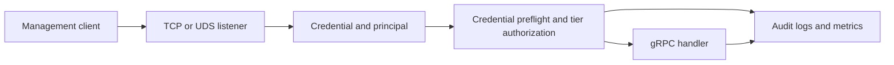

# ADR-0064 gRPC authorization threat model

**Status:** Current
**Date:** 2026-07-26
**Scope:** The production gRPC management plane: listener admission, method-tier
authorization, principal-to-role authorization, and its audit and resource
boundaries. BGP transport, the CLI, build/release systems, and non-gRPC APIs are
out of scope.

## Executive summary

The shipped posture is enforced tier authorization, not an audit-only overlay.
Every gRPC call is classified by a checked method matrix and constrained by the
listener's `max_tier`; in the default `tier` mode the authorization layer also
applies the configured role ceiling before dispatch. Bearer authentication is
still enforced by the listener's interceptor before the handler runs. The
important remaining risks are the blast radius of a valid accepted credential,
operators' collection of the audit trail, resource consumption by accepted
clients, and request/log floods from network-reachable callers before
authentication succeeds. This document does not assume that one accepted
credential reaches the entire read-write surface.

## Scope and assumptions

- `security.grpc.enforcement = "tier"` is the default since v0.24.0 and the
  sole typed value. The removed `legacy` value cannot reach runtime; its exact
  semantic config path receives migration guidance after deserialization
  rejects it.
- The daemon is deployed on a management network. Network reachability,
  certificate issuance, bearer-token distribution, UDS permissions, and log
  collection are operator responsibilities outside this process.
- The threat model treats the checked matrix as the current contract rather
  than duplicating its method list. The matrix and both published inventories
  are test-fenced in both directions.
- No claim here treats configuration validation as a substitute for protecting
  the management network or for promptly rotating compromised credentials.

Open deployment questions that affect the likelihood ratings are whether TCP
listeners are reachable outside the management network, how client credentials
are issued and revoked, and where `grpc_authz` logs are retained and who may
query them.

## System model

### Authorization path

1. A client reaches a configured TCP or UDS gRPC listener. Tier-mode validation
   rejects an implicit listener, an unauthenticated TCP listener, a bearer or
   UDS listener without a configured and mapped principal, and an attempt to
   map the reserved `mtls-unresolved` principal.
2. The listener supplies an identity: mTLS derives one from an already
   validated peer certificate (`rustbgpd` URI SAN, then email SAN, then Subject
   CN), skipping an unsafe candidate in favor of a later safe field.
   Bearer-token TCP and UDS listeners use an explicit configured principal. If
   no usable mTLS identity remains, extraction becomes `mtls-unresolved`.
3. `GrpcAuthzLayer` looks up the request path. A known method gets its checked
   tier; an unknown path is `operator_only`. Before returning a listener-cap or
   role denial for a bearer listener, the layer authenticates the credential
   itself so an invalid caller cannot use `PERMISSION_DENIED` as a tier oracle.
   After that preflight, it rejects tiers above the listener `max_tier`, then,
   in `tier` mode, rejects an unmapped principal or one whose role ceiling is
   too low. Those paths return before dispatching to the handler.
4. A call that passes the layer still traverses the per-service bearer
   interceptor before its handler. Forwarded calls receive a result-aware
   `grpc_authz` record for handler admission and the initial response; denied
   calls also receive a decision record and bounded-label metric.
   Credential-bearing request summaries are masked by the audit helpers.

### Trust boundaries and assets

| Boundary or asset | Security objective | Evidence |
| --- | --- | --- |
| Client to TCP/UDS listener | Admit only a configured identity path; avoid an anonymous tier-mode listener | `src/config/validation.rs::validate_grpc_tier_enforcement` |
| Listener to authorization layer | Enforce the listener ceiling independently of role mapping | `crates/api/src/authz_runtime/layer.rs::GrpcAuthzService::call` |
| Principal to role map | Restrict the accepted identity to `observer`, `automation`, or `operator` authority | `crates/api/src/authz.rs::PrincipalRole`; `authz_runtime/context.rs::role_denial` |
| Method matrix and published inventory | Keep authorization classification complete and reviewable | `crates/api/src/authz.rs::METHODS` and its inventory tests |
| Route, topology, policy, and configuration data | Preserve confidentiality and integrity of operational state | `docs/grpc-method-inventory.md` |
| Mutating and operator-only RPCs | Prevent unauthorized session, policy, configuration, route-injection, and dataplane changes | `docs/grpc-method-inventory.md` |
| `grpc_authz` records and decision metrics | Support attribution and detection without exposing credentials | `crates/api/src/authz_runtime/decision.rs`; `crates/api/src/audit.rs` |

## Attacker model

### Capabilities

- A network-reachable caller can attempt arbitrary gRPC paths and malformed or
  missing bearer credentials.
- A caller holding a valid credential, UDS access, or an accepted mTLS
  certificate can exercise only the permissions associated with that identity,
  listener, and method tier.
- A malicious or faulty accepted client can retain streams, issue expensive
  sensitive reads, or generate audit volume within its role and listener cap.

### Non-capabilities

- An unauthenticated caller is not assumed to bypass mTLS, bearer verification,
  UDS permissions, or tier-mode startup validation.
- A credential accepted by one listener is not assumed to bypass that
  listener's `max_tier`. Under the sole `tier` mode it is also not assumed to
  gain tiers above its configured role.
- Unknown gRPC paths are not assumed to inherit a permissive default: they are
  classified as `operator_only`.

## Threat model

| ID | Abuse path and impact | Existing controls | Residual gap and priority |
| --- | --- | --- | --- |
| TM-001 | A stolen or wrongly issued credential performs operations permitted to its role, potentially changing peers, policy, configuration, route injection, or FIB state. Impact is high when the identity is `operator`. | mTLS/bearer/UDS identity paths; role ceilings; listener `max_tier`; `operator_only` classification. | Role scope is intentionally coarse and operator-controlled. **High**: likelihood depends on credential handling, impact is high for operator identities. Prefer small listener ceilings and separate identities by duty. |
| TM-002 | A role or listener configuration maps an identity more broadly than intended, turning a normal accepted client into a higher-tier principal. | Tier-mode validation requires mapped explicit non-mTLS principals; unmapped identities are denied; a separately narrower listener ceiling is defense in depth. | Role-map review and credential issuance happen outside the request path. **Medium**: configuration error is plausible, and the listener ceiling reduces impact only when it is independently stricter than the mistaken role or listener configuration. Review both with the same care as privileged configuration changes. |
| TM-003 | An accepted `sensitive_read` client repeatedly opens streams or requests large snapshots, consuming CPU, memory, sockets, or log capacity. | Method tiers, pagination/bounded histories, stream lag and subscriber metrics; the `GnmiService` has a 64-stream `Subscribe` semaphore. | That semaphore is not a per-principal budget, and there is no general per-principal request-rate or stream-count budget. **Medium**: an accepted client is required, but availability impact can be material. Use management-network and upstream rate controls; alert on stream and authz metrics. Client deadlines help with faulty or cooperative clients, not a malicious one. |
| TM-004 | Audit records are unavailable, insufficiently retained, or accessed by the wrong party after a management-plane event, impairing attribution or disclosing operational metadata. | Structured records, bounded result labels, and masked credential-bearing summaries; forwarded records include handler admission and the initial response. | Streaming records do not attest to the terminal stream outcome. The daemon relies on journald, syslog, or an external agent; a durable in-daemon audit sink and its backpressure semantics are intentionally deferred. **Medium**: impact is primarily detection/forensics, but it affects every management-plane action. |
| TM-005 | Authorization or credential material changes while accepted calls, streams, or TLS connections remain live. | Listener shape, auth mode, principal, roles, and access settings are restart-required and remain pinned to the startup generation. SIGHUP rotates bearer and mTLS material at unchanged paths; new bearer RPCs use the new token generation and new TLS connections use the new certificate generation. | Admitted streams continue, and an existing mTLS connection remains accepted and can make further calls. **Medium**: immediate role revocation requires restart; immediate mTLS revocation also requires ending existing connections. Client deadlines can bound cooperative streams but are not forced revocation. |
| TM-006 | An unauthenticated network-reachable caller floods bearer requests, TLS connections, or malformed paths, consuming request processing and audit/log capacity. | Invalid bearer requests fail authentication; mTLS handshakes have concurrency and time bounds; unknown paths are `operator_only`. | There is no general connection or request rate limiter, and bearer failures still emit `grpc_authz` records. **Medium** when a listener is broadly reachable; keep it on a restricted management network and enforce upstream connection/request limits. |
| TM-007 | A new RPC or generated route evades a low-risk classification and is exposed through a less restrictive listener. | The static matrix is checked against both protobuf inputs and the JSON/Markdown exports; unknown paths fail closed as `operator_only`. | Classification correctness still depends on review of a new method's semantics. **Low**: the structural fence makes omission fail closed, but a wrongly chosen known tier remains a review risk. |
| TM-008 | An operator carries the retired `legacy` value into an upgrade and mistakes its migration diagnostic for an optional warning. | Typed config accepts only `tier`; boot, reload, and `--check` reject the exact retired value with paste-ready migration guidance. | **Low**: the removed mode cannot reach runtime. The remaining risk is delayed upgrade until the operator deletes the local-only block or maps named principals. |

## Operational mitigations and detection

- Configure every remote listener with the smallest `max_tier` it needs; use
  separate listeners and principals for observation, automation, and operator
  actions.
- Treat `[security.grpc.roles]`, listener `principal`, mTLS client issuance,
  bearer-token files, and UDS permissions as privileged configuration. Remove
  retired Legacy config before upgrade; it cannot be re-enabled.
- Collect and protect `grpc_authz` structured records; alert on
  `listener_tier_denied`, `principal_unmapped`, `role_tier_denied`,
  both `authn_failed` and `handler_unauthenticated` authentication failures,
  and unexpected operator-tier calls.
- Monitor `bgp_grpc_authz_decisions_total`,
  `bgp_event_stream_subscribers`, and `bgp_event_stream_lagged_total`.
  Nonzero lag means a live event subscriber missed data; it is not a durable
  queue guarantee.
- Use management-network and upstream rate restrictions to constrain malicious
  request floods. Use client deadlines to bound cooperative or faulty callers
  until a per-principal budget design is justified.

## Evidence and review focus

| Path | Why it matters |
| --- | --- |
| `crates/api/src/authz.rs` | The method matrix, tier ordering, roles, and tests that fence the published inventory. |
| `crates/api/src/authz_runtime/layer.rs` | Ordering of authentication, listener-cap, role-denial, handler dispatch, and audit recording. |
| `crates/api/src/authz_runtime/context.rs` | Principal resolution and tier-mode role denial behavior. |
| `crates/api/src/authz_principal.rs` | mTLS principal extraction and sanitization. |
| `src/config/validation.rs` | Startup rejection of unsafe tier-mode listener configurations. |
| `crates/api/src/audit.rs` | Credential masking and request-summary boundaries. |
| `docs/grpc-method-inventory.json` | Machine-readable review artifact, fenced to the runtime matrix. |
| `docs/OPERATIONS.md` | Audit collection, stream metrics, and accepted-client operational guardrails. |

## Verification notes

This is a docs-only change; no new runtime test is added, so a load-bearing
red-proof is **N/A**. The factual baseline was checked directly against:

- `GrpcAuthzService::call`, which performs both denials before `inner.call`;
- `GrpcAuthAuditContext::role_denial`, which denies unmapped principals in
  `tier` mode;
- `validate_grpc_tier_enforcement`, which rejects unsafe tier-mode listener
  configurations, and `validate_grpc_security`, which disallows a role mapping
  for `mtls-unresolved` in every mode;
- the `authz` tests that compare `METHODS` with both protobuf inputs and both
  published inventories; and
- the documented operational limits and signals in `docs/SECURITY.md` and
  `docs/OPERATIONS.md`.

The key review rule is therefore explicit: under the sole `tier` mode, a
valid accepted management-plane identity can use only the method tiers granted
by both its role and listener. Retired Legacy config is rejected before
runtime and gets migration guidance only at its exact semantic path. These
current-status notes do not alter ADR-0064's historical decision record.
