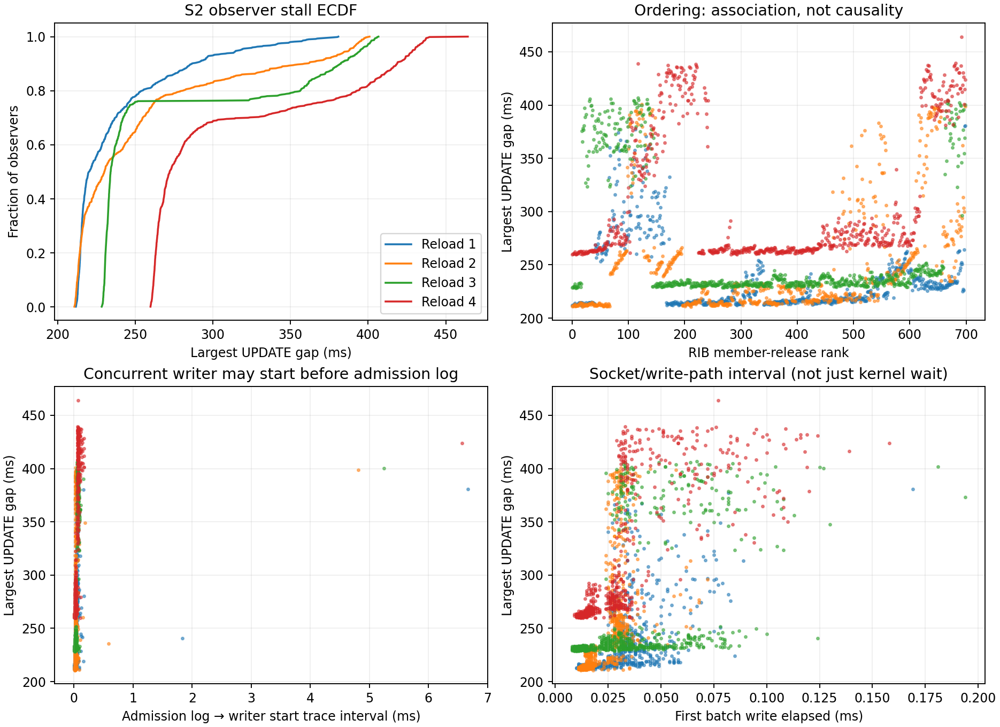

# Reload observer-tail attribution — October 2026

A native-loopback diagnostic traces all 700 observers through four policy reloads,
placing most first-write tail time outside the sampled write future.

Every observer's largest UPDATE gap ended at its first base-prefix UPDATE carrying
the expected policy generation. All 2,800 instrumented first chunks matched a
writer batch by FIFO byte position. Those writes returned without `Pending` and
took at most 0.194 ms through the measured write path. The larger measured
intervals were consumer entry to first admission and writer start to the parsed
observer event. These findings select further measurements; they establish no
production optimization or causal speedup.

## Workload and evidence

The 2026-10-06 run used 700 peers, 400,400 prefixes (572 per source), four reloads
changing all peers, a 30-second control period, zero added RTT, and unpaced
readers. It retained the historical import-plus-export policy workload: the
generated configuration changed an out-of-table import reject prefix and the
export community. The runner's `current` receipt vocabulary did not select an
export-only policy for this shape. Every
round kept 700 sessions up with zero parse errors; every observer completed the
initial exact bitmap of 399,828 received prefixes. Readiness probes were disabled.

The source base was `19842a5a114287af7a8f5ae66407aaacc9d0142a`, built with Rust
1.99.0 on Linux 7.0.0-30-generic x86_64. A clean control daemon and a locally
instrumented daemon used the same `rustbgpd-transport/bench-internals` feature and
the same observer binary. The instrumented source and binaries were archived;
all five source edits were then restored. This publication changes no daemon
instrumentation, runtime setting, or acceptance threshold.

Control ran first, followed by the probe: **one process per arm and four
correlated reloads per process**. Each leg passed two quiet-host samples 30
seconds apart and retained a full 300-second cooldown. Drivers, runners,
daemons, analysis, provenance verification, and final cleanup exited zero. The
owned processes, scopes, and scenario files were removed and the shared mutex
released. [Provenance and compact evidence](artifacts/reload-observer-tail-2026-10-06/README.md)
retain hashes, workload inputs, quiet samples, native maps, observer rows, and
the limits of independently auditing unpublished raw files.

An earlier diagnostic attempt failed strict stage attribution and is excluded
from these measurements. It had duplicate initial/convergence events and a
missing RIB probe in the reused build artifact. The replacement used scoped
inventory identities, verified compiled probe sites, and a 12-peer functional
smoke before both fresh fleet legs. The failed archive remains retained as
method history; it supplies no successful attribution result.

## Observer distribution and probe perturbation

The table uses nearest-order-statistic quantiles from 700 individual maximum
gaps per round. It does not pool observers or treat reloads as independent runs.

| Reload | Control p50 / p95 / maximum (ms) | Probe p50 / p95 / maximum (ms) | Native completion p50, control / probe (s) |
|---|---:|---:|---:|
| 1 | 219.888 / 295.679 / 383.102 | 220.363 / 317.600 / 380.805 | 1.003630 / 1.009550 |
| 2 | 220.575 / 373.524 / 388.809 | 230.044 / 387.987 / 400.900 | 0.951539 / 0.922046 |
| 3 | 217.958 / 372.038 / 388.758 | 234.099 / 395.027 / 406.658 | 0.894922 / 0.883126 |
| 4 | 226.954 / 374.204 / 403.168 | 272.216 / 428.839 / 464.226 | 0.920438 / 0.872213 |

Separately, the median of four native per-reload maximum-gap p50s increased from
220.2315 to 232.0715 ms (about 5.38%). The median of four native completion p50s
fell from 0.9359885 to 0.902586 seconds (about 3.57%). These medians average the
middle two aggregate values; they are distinct from each round's nearest-order
statistic across individual observers. The differences describe this pair and
do not establish an acceptable instrumentation overhead.

The probe's daemon log was 229,470,514 bytes, versus 8,179,071 bytes for control.
Before the first trigger alone it recorded 244,300 consumer entries and 244,300
first admissions, 349 producer triplets, and 701 writer samples. Instrumentation
was active throughout initial convergence and control traffic. This is real
perturbation, even though first reload stages have complete attribution. The
fixed arm order and single process per arm cannot estimate stable overhead or
statistical significance. Probe tails are not clean production tail estimates.

The slowest 35 observers changed across rounds: their union contained 119
observers, and none appeared in all four sets. Pairwise overlaps were 0–8;
full observer-rank correlations were 0.311–0.579. This shows changing tail
membership within this process, without proving a random tail or excluding
persistent socket effects.

## Where the trace places the delay

Each instrumented reload has exactly 700 unique member releases, consumer
entries, and first accepted admissions, one producer, and 700 FIFO-matched
first-chunk writer batches. The inventory sizes were 400,432 / 400,416 / 400,464 /
400,448 rows as control traffic changed the inventory. Logical per-round aliases
replace raw allocation identities in the published files. Additional writer
samples were retained and excluded from the first-chunk join by byte position.

| Measured interval or association | Reload 1 | Reload 2 | Reload 3 | Reload 4 |
|---|---:|---:|---:|---:|
| First-to-last member release, ms | 124.644 | 149.014 | 121.259 | 143.370 |
| Release → consumer entry p95, ms | 0.022 | 0.227 | 0.956 | 0.019 |
| Consumer entry → accepted admission p95, ms | 50.427 | 21.862 | 108.449 | 110.290 |
| Admission log → writer start p95, ms | 0.061 | 0.041 | 0.079 | 0.097 |
| First matched write elapsed p95, ms | 0.058 | 0.037 | 0.083 | 0.087 |
| Writer start → parsed observer event p95, ms | 52.114 | 158.784 | 68.075 | 72.018 |
| Release rank / maximum-gap Spearman correlation | 0.083 | 0.415 | 0.008 | 0.262 |
| Admission time / maximum-gap Spearman correlation | 0.954 | 0.905 | 0.907 | 0.949 |

These are separate distributions, so their quantiles must not be added. Actual
member-release rank is measured at release; observer index is a harness identity.
They happened to agree in this leg. Weak overall rank association does not make
release scheduling irrelevant: the 121–149 ms release spans and rare
release-to-consumer delays up to 144.826 ms leave a small late group exposed even
when most consumers enter promptly. Source work budgets and fairness remain
measurement leads.

The sole elected encoder published its first chunks about 4.7–5.6 ms after the
first release, then finished about 84–96 ms after first publication. Consumer
entry to admission includes waiting for published chunks, local scheduling, and
admission work. For the slowest 35 observers, its median was 48.055 / 18.285 /
101.679 / 102.954 ms. A strong admission-time association does not identify which
of those components caused the delay.

Admission timestamps are logged after successful enqueue. The signed interval
to writer start is therefore a trace interval, not exact queue residence or OS
runnable delay; a concurrent writer can start before that log. The maximum was
6.667 ms here. The write elapsed interval includes local write-path setup, and
`busy_ns` measures wall time inside `Future::poll`, including scheduler
preemption; it is not CPU time. All 2,800 matched writes had zero
`Pending` polls. This constrains these sampled first writes only; it does not
measure later stream backpressure. In general `Pending` also includes cooperative
budget and scheduling effects, and poll counts do not count kernel wakeups.

The observer timestamp is taken after read, decode, and NLRI classification.
Writer start to that event includes socket/kernel delivery, receiver queues,
receiver scheduling, and harness parsing. Its 52–159 ms p95 cannot be attributed
to kernel queues alone. `SO_SNDBUF` was 2,626,560 bytes throughout: that is buffer
capacity, not occupancy. No socket-queue occupancy or OS writer-wakeup counts
were collected.

## Bounded follow-up

The next useful experiment would separate receiver scheduling/parsing from
delivery in the 52–159 ms post-writer p95 interval, and separate publication wait
from consumer scheduling in the 22–110 ms consumer-to-admission interval. The
121–149 ms release span should remain visible in that experiment. These are
measured phase budgets to explain, not promised recoverable gains.

Any later candidate should preserve a predeclared maximum 2% regression in
maximum-gap p50 and completion, with a repeatable tail improvement across
independent runs. This diagnostic alone neither reopens rejected unsent-threshold
settings nor establishes a new cross-daemon comparison. The earlier
[unsent-threshold screen](tcp-unsent-threshold-screen-2026-10.md) remains scoped
to its own candidate, workload, and failed completion gate.
